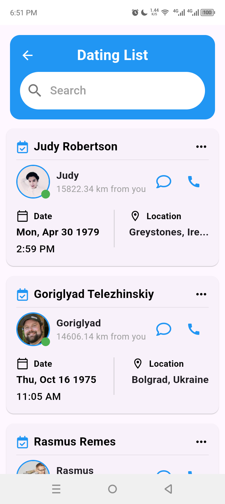
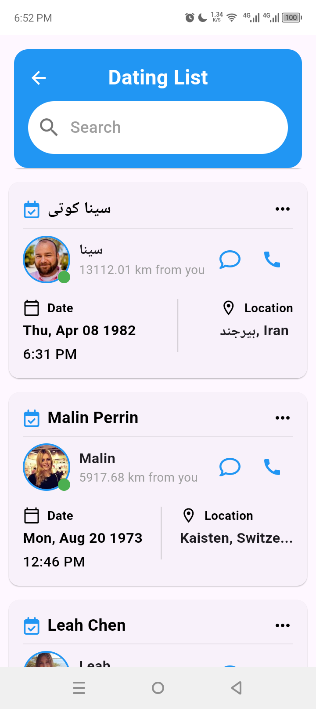

### Output


# Flutter App

A simple Flutter application to get started with Flutter development.

## Getting Started

Follow these steps to run this Flutter app on your machine.

### Prerequisites

Before getting started, make sure you have:

- **Flutter SDK**: [Install Flutter](https://flutter.dev/docs/get-started/install)
- **Android Studio** or **Visual Studio Code**: Install either for code editing and running the app.
- **Xcode** (for iOS): Install on macOS if you plan to build for iOS.

### Clone the Repository

1. Open your terminal or command prompt.
2. Clone the repository using the following command:

   ```bash
   git clone https://github.com/yourusername/flutter-app.git
   ```

3. Navigate into the project directory:

   ```bash
   cd flutter-app
   ```

### Install Dependencies

After cloning the repo, install the required dependencies:

```bash
flutter pub get
```

### Run the App

Now you are ready to run the app.

To run the app on an emulator or a physical device, use:

```bash
flutter run
```

This will launch the app on your connected device or emulator.

### Run on iOS (macOS Only)

If you're on macOS and want to run the app on an iOS device, ensure you have Xcode installed and then run:

```bash
flutter run
```

### Run on Android

Ensure an Android emulator is running or a physical device is connected, then run:

```bash
flutter run
```

### Build APK for Android

To build the APK for release on Android:

```bash
flutter build apk
```

### Build iOS App

For iOS build (only on macOS):

```bash
flutter build ios
```

### Clean Project

To clean the Flutter project (removes build artifacts), use the following command:

```bash
flutter clean
```

### Contributing

- Fork the repo.
- Create a new branch:
  ```bash
  git checkout -b feature/your-feature
  ```
- Commit your changes:
  ```bash
  git commit -am 'Add your feature'
  ```
- Push to the branch:
  ```bash
  git push origin feature/your-feature
  ```
- Open a pull request.

### License

This project is licensed under the MIT License. See the LICENSE file for details.